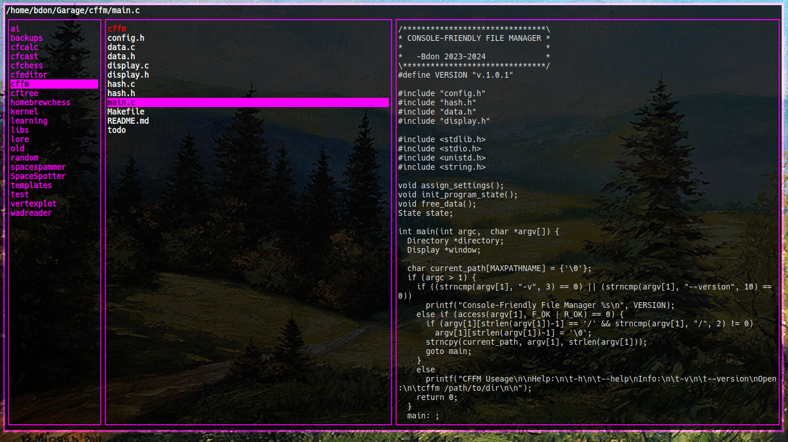
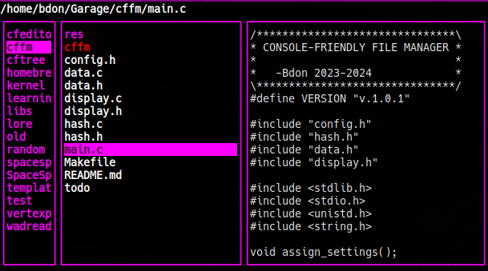
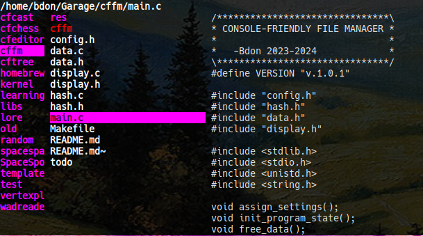

# Console-Friendly File Manager

CFFM is a minimalist terminal-based file manager. Heavily inspired by similar terminal based file managers such as `ranger` and `lf`, CFFM seeks to provide a clean, snappy, and customizable file managing experience while adherign to a minimalist, Unix-like philosophy.

## What's New [v1.0]
-After being in development for two months (on and off), CFFM is officially released, with all of it's basic functionality tested and working.

-Added cut/copy/paste and selection functionality.

-Fixed file previews.

-Various bug fixes

## Download
You can download a static "just works" binary from the releases section.

## Build and Install
Dependencies:

'libncurses-dev' (Debian)

Compiling:

`make` for a slim, dynamically linked binary.

`make release` for a static binary.

Installing:

`make install`

## Uninstall CFFM
`sudo make uninstall`

# Configuration
You can modify any `#define` value in `config.h` to your liking. When done, simply re-compile and run.

## Runtime customization
By pressing `b` by default you can show/hide the border. Of course you can configure this to your liking in `config.h`.

versus

# Philosophy
CFFM's design philosophy was inspired heavily by the [Suckless Philosophy](https://suckless.org/philosophy/). Whether or not experienced hackers would consider CFFM truely "Suckless" or "KISS" is debatable, however one thing is for sure, and that is that CFFM is minimalist and not bloated. I have been using `ranger` for about a year now, and I couldn't help but notice that it was lagging behind and sometimes not responsive. This is because it was written in python, and was calling external scripts to execute commands. I was interested switching to the file manager `lf`, however it too used external configuration files and building it required installing golang. I always liked Suckless' `dwm` and `st` due to their configuration being compiled directly into the program, as well as for the fact that they are extremely portable and light programs. So, I decided to write my own terminal file manager, with simplicity and portability in mind.
